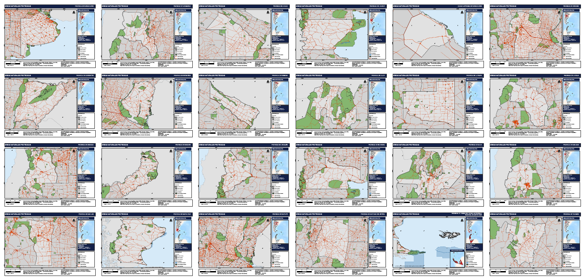
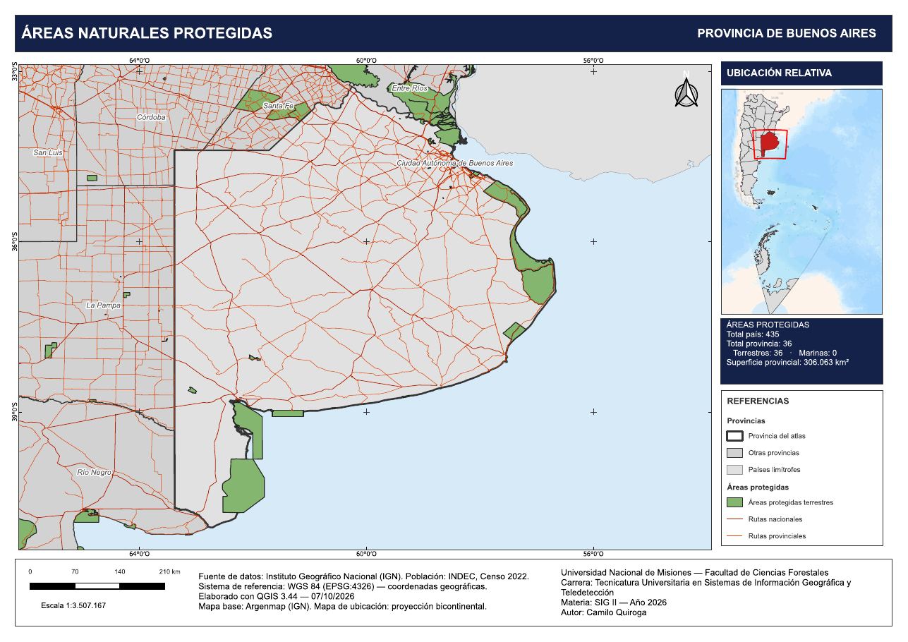
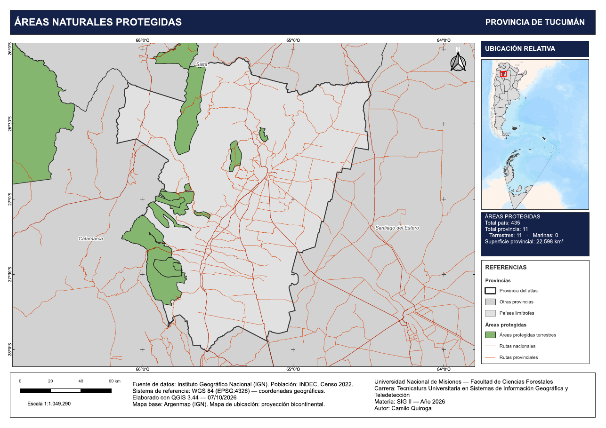
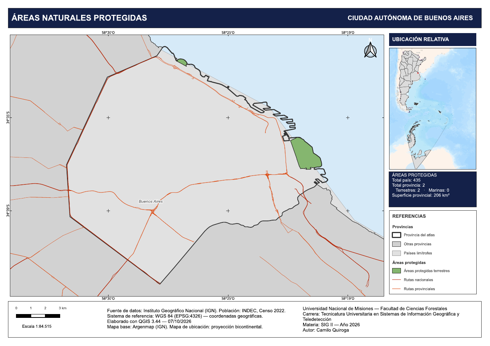
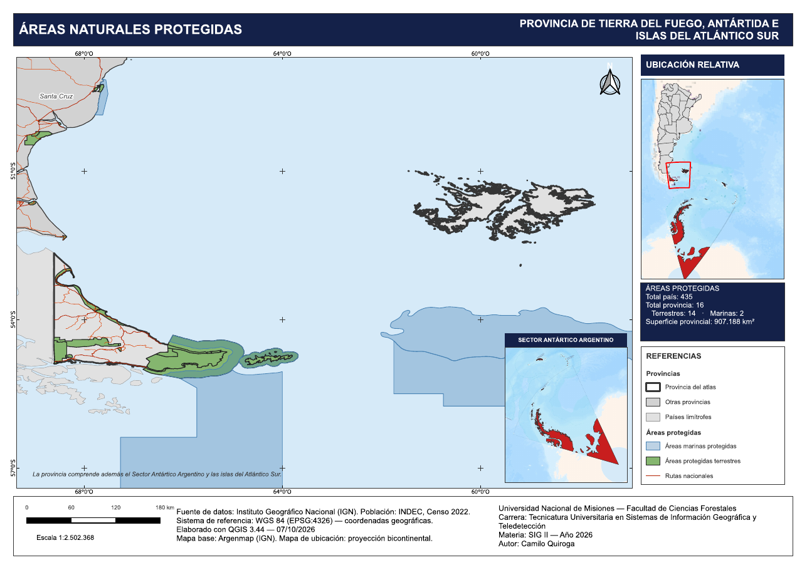

# Atlas de Provincias Argentinas — Áreas Naturales Protegidas

Atlas cartográfico automatizado de las 23 provincias argentinas y la Ciudad Autónoma de Buenos Aires, elaborado en **QGIS** con la herramienta **Atlas**. Un único diseño cartográfico genera la serie completa de 24 mapas: título, encuadre, mapa de ubicación y datos se adaptan automáticamente a cada provincia.

Actividad de cierre de **Sistemas de Información Geográfica II** — Unidad VI: Automatización cartográfica y visualización de información geográfica.
Tecnicatura Universitaria en Sistemas de Información Geográfica y Teledetección — Universidad Nacional de Misiones, Facultad de Ciencias Forestales — 2026.



📄 **[Ver el atlas en PDF (24 hojas, versión web)](output/atlas_provincias_web.pdf)**

⬇️ **[Descargar el atlas en alta calidad — PDF vectorial (Releases)](../../releases/latest)**

---

## Vista previa

| Buenos Aires | Tucumán |
|---|---|
|  |  |

| Ciudad Autónoma de Buenos Aires | Tierra del Fuego, Antártida e Islas del Atlántico Sur |
|---|---|
|  |  |

---

## Características

**Automatización con Atlas**
- Capa de cobertura con una entidad por provincia; nombre de página y orden alfabético por el campo `nam`.
- Mapa principal controlado por el Atlas (margen del 10 %).
- Simbología basada en reglas con `@atlas_pagename` para resaltar la provincia de cada hoja.

**Elementos dinámicos**
- Título con el nombre oficial de la provincia.
- Recuadro de datos calculado con expresiones (`aggregate`, `get_feature`): total de áreas protegidas del país y de la provincia, discriminadas en terrestres y marinas, y superficie provincial.
- Etiquetas de provincias vecinas, leyenda filtrada por el contenido del mapa, grilla con intervalo automático y escalas gráfica y numérica.

**Mapa de ubicación bicontinental**
- Proyección Lambert Azimutal Equivalente (latitud de origen −40°, longitud −60°, WGS 84).
- Mapa base Argenmap del Instituto Geográfico Nacional.
- Provincia en rojo y recuadro con la extensión del mapa principal.

**Tierra del Fuego, Antártida e Islas del Atlántico Sur**
- Capa de cobertura propia que encuadra Isla Grande, Isla de los Estados y Malvinas.
- Inserto del Sector Antártico Argentino (proyección polar EPSG:3031) y nota aclaratoria, visibles solo en esa hoja mediante reglas de exclusión en la exportación.

**Contenido temático**
- Áreas naturales protegidas diferenciadas en terrestres y marinas.
- Red vial nacional y provincial, países limítrofes y mar.

---

## Estructura del repositorio

```
atlas-provincias/
├── atlas_provincias.qgz        Proyecto de QGIS (rutas relativas)
├── output/
│   └── atlas_provincias_web.pdf  Atlas exportado (24 hojas, versión web)
├── datos/
│   └── README.md               Cómo obtener y ubicar el GeoPackage
└── img/                        Vistas previas
```

Por su tamaño, en la sección **[Releases](../../releases)** se distribuyen:
- `atlas_provincias.pdf`: atlas en alta calidad (vectorial, 68 MB).
- `atlas_provincias.gpkg`: GeoPackage con todas las capas del proyecto (114 MB).

---

## Cómo abrir el proyecto

1. Clonar o descargar el repositorio.
2. Descargar `atlas_provincias.gpkg` desde [Releases](../../releases) y colocarlo en la carpeta `datos/`.
3. Abrir `atlas_provincias.qgz` con **QGIS 3.44** o superior.
4. Ir a *Proyecto → Administrador de composiciones → Atlas Provincias*.
5. Activar *Vista previa del atlas* y recorrer las hojas.

El mapa base Argenmap se carga desde los servidores del IGN y requiere conexión a internet.

---

## Fuentes de datos

- **Instituto Geográfico Nacional (IGN)**: límites provinciales, áreas protegidas, red vial nacional y provincial.
- **Argenmap (IGN)**: mapa base del mapa de ubicación.
- **QGIS**: mapa base de países limítrofes.

Sistema de referencia del mapa principal: WGS 84 (EPSG:4326).

---

## Autor

**Camilo Quiroga** — [github.com/camiloquirogadev](https://github.com/camiloquirogadev)
